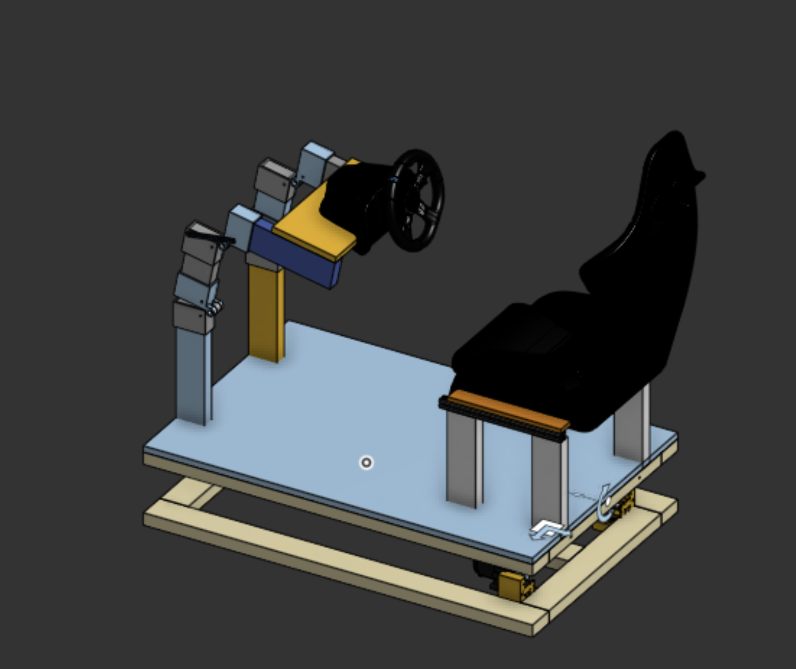

 

  

# DIY-Racing-Rig
Making a realistic racing sim that moves with the game.
By Arnav Purbiya and Sai Avula

# Table of Contents

- [System Overview](#system-overview)
- [CAD](#cad)
- [3D Printing Guide](#3d-printing-guide)
- [Assembly Guide](#assembly-guide)
- [Electronics](#electronics)
- [Firmware](#firmware)
- [BOM](#bom)

# System Overview

# CAD
You can find the cad on onshape, link down bellow
https://cad.onshape.com/documents/b552f3261af86a9135d49db9/w/8cfbd36bcd7ad18b09077ea0/e/34b6498e013fb992d3270d66?configuration=default&renderMode=0&uiState=69d663939217aa308a3ff657

## 3D Printing Guide

For structural components like the U-Joint and Center, **PETG** is preferred for its impact resistance and durability. If substituting with **PLA**, ensure the part is kept away from high-heat environments.

| Part Name | Qty | Material (Rec.) | Infill / Settings | Notes |
| :--- | :---: | :--- | :--- | :--- |
| **Hinge P1** | 4 | PLA | Default | Standard settings. |
| **Hinge P2** | 4 | PLA | Default | Standard settings. |
| **Hinge Strap** | 4 | PLA | Default | Standard settings. |
| **U-Joint Top** | 1 | PETG | 50% | High stress; PLA acceptable at 50%. |
| **U-Joint Bottom** | 1 | PETG | 50% | High stress; PLA acceptable at 50%. |
| **U Joint Center** | 1 | PETG | 50% (4 Walls) | Structural core; use 4 wall loops. |
| **Motor Mounts** | 2 | PLA | 20% | Standard settings. |
| **Motor Control Arms**| 2 | PETG | 80% Gyroid | Use Gyroid infill for maximum rigidity. |

---

## Assembly Guide

### Phase 1: The Cut List

Before beginning assembly, reference the `cut_list.png` diagram. 
* **Stock:** Use (6) standard 8-foot 2x4s.
* **Precision:** The cut list accounts for the saw blade kerf. 
* **Scrap:** Expect a small amount of leftover material at the end of each board.

### Phase 2: Building the Dual Bases

You will need to construct **two identical base units** following the `base_assembly` guide. 
1. Lay out the 2x4 segments as indicated in the assembly diagram.
2. Fasten the joints using wood screws or heavy-duty lag bolts. 
3. **Note:** One base will serve as the ground foundation, while the second will serve as the top platform mounted to the U-Joint.

### Phase 3: The U-Joint & Center Hub

This is the mechanical heart of the build. The U joint is put together with 4 M10 Bolts and Lock Nuts 
1. **Lower Mount:** Attach the **U-Joint Bottom** to the center of the ground base. 
2. **Center Integration:** Insert the **Center Hub** into the U-Joint assembly.
3. **Upper Mount:** Attach the **U-Joint Top** to the 41-inch center 2x4 of the second (top) base.
4. **Final Marriage:** Join the top base assembly to the bottom base assembly via the U-Joint. Ensure all mechanical pivots move freely before tightening fasteners.

### Phase 4: Steering Wheel Stand Assembly

The steering wheel stand is a hinged vertical assembly. Reference the `upper_assembly` diagram for specific orientation.
1. **Hinge Preparation:** Connect **Hinge 1** and **Hinge 2** using an **M10 bolt and nut**. Ensure the hinge is snug but allows for smooth rotation.
2. **Wood Sequence:** Mount the 2x4 segments to the hinges using wood screws. The assembly order from top to bottom is:
    * **15-inch segment** (Top)
    * **8.5-inch segment** (Middle)
    * **13-inch segment** (Bottom)
3. **Orientation:** When mounting, ensure the **hinge pivot point faces the inside** of the assembly to allow for proper folding/adjustment.

### Phase 5: Seat Stand Installation
The seat stand is adjustable based on your specific seating hardware.
1. **Placement:** Take the (4) **12-inch 2x4 segments**.
2. **Mounting:** Screw these into the bottom base assembly. 
3. **Spacing:** Adjust the distance between these segments to match the mounting rails or holes of your specific seat before final fastening.

### Phase 6: Motors and Linkage
1. **Actuation:** Install the **Motor Mounts** to the designated points on the frame. 
2. **Linkage:** Connect the **Motor Control Arms** between the motors and the moving frame. These arms provide the mechanical leverage for the motion system.
3. This is all done with the threaded rods and the bearing rod ends
---

## Electronics

#### Connect the 2 motor controllers to the Arduino uno R3, connect each power supply to its individual motor controller, and connect each AS5600 Magnetic Encoder to the Arduino Uno analog pins, power the Arduino uno with a laptop which also communicates over serial for movement. The motor with the encoder creats a closed loop system which helps track movement exactly.  
---

## Firmware
This is untested software, but the code talks to simtools which takes data from game and sends it to Arduino over serial and lets the Arduino make the movements necessary. The code is uploaded onto the arduino uno using a printer cable via the arduino IDE

## BOM 
|Name                       |Purpose         |Quantity                                                                                                                                                                                                                                                                                                                                                                                                                                                                                                                                      |Total Cost (USD)                                                                                                                                                                                                                                                                                                                                                                                                                                                                                                                                                               |Link                                                                                                                                                                       |Distributor   |
|---------------------------|----------------|----------------------------------------------------------------------------------------------------------------------------------------------------------------------------------------------------------------------------------------------------------------------------------------------------------------------------------------------------------------------------------------------------------------------------------------------------------------------------------------------------------------------------------------------|-------------------------------------------------------------------------------------------------------------------------------------------------------------------------------------------------------------------------------------------------------------------------------------------------------------------------------------------------------------------------------------------------------------------------------------------------------------------------------------------------------------------------------------------------------------------------------|---------------------------------------------------------------------------------------------------------------------------------------------------------------------------|--------------|
|Wood screws 2.75in         |To attach all the wood|1                                                                                                                                                                                                                                                                                                                                                                                                                                                                                                                                             |12.98                                                                                                                                                                                                                                                                                                                                                                                                                                                                                                                                                                          |https://www.homedepot.com/p/Everbilt-10-x-2-3-4-in-Brown-6-Lobe-Torx-Drive-Exterior-Flat-Head-Multi-Material-Screw-1-lbs-Box-69-Piece-115317/331301660                     |Home Depot    |
|1/4-20 lock nuts           |nuts for screws |1                                                                                                                                                                                                                                                                                                                                                                                                                                                                                                                                             |3.95                                                                                                                                                                                                                                                                                                                                                                                                                                                                                                                                                                           |https://www.amazon.com/WEGOUP-Stainless-Insert-Self-Locking-Coarse/dp/B0DJGTG4YM/ref=sr_1_7?crid=1H9A35MZWB877&dib=eyJ2IjoiMSJ9.F7hPdTX8mrMK389myoE2TQ2jE32O21w66FLA46Be5c7Yx-i-NrXtHDjcT8VH3tu6YmzXk1oLVWo7ndTl6xjI3LChY3lVtZoAriT-z6KOhMHrz2teuNPTfqOP00xjGlhieF-9uT1SGAE44gDWIBDikhhiPTgbhJ30BQpy2_rspTQiSsbnmaTAHiLdLIZ1Q8UzZYH66Hwq97AW1MmkDyJnDUQOm9YYfSIpiT7gmx8Zsc0.DtR5cQFk-9YvkFrv221_WB6RMguTIWYEfxLoYzcnFwo&dib_tag=se&keywords=1%2F4-20+lock+nut&qid=1775165323&sprefix=1%2F4-20+lcok%2Caps%2C357&sr=8-7|Amazon        |
|1/4-20 x2in Screw          |Screws for the hinge|1                                                                                                                                                                                                                                                                                                                                                                                                                                                                                                                                             |5.99                                                                                                                                                                                                                                                                                                                                                                                                                                                                                                                                                                           |https://www.amazon.com/Machine-Phillips-Stainless-Bright-Finish/dp/B0CXD12HPQ/ref=sr_1_7?crid=199W7RFM44EFH&dib=eyJ2IjoiMSJ9.XjyJhWlcVi5YxwjOmiErR4iNEkazL30FQAeFvKxY2_O6SMLVXi1XzkBpuxyycnWFvyvnR9xOOUWjgEjtqJKkJKv-tP5xxkyBhMXp4LkqIAQETqus06vM9WWwiECbLDhFD6tF7K0Is8rczwDTXolrX7laW1aU14h_yuGXyRl8PM1HkCLZVDH4KXWkjkYE67iizpFYPjiXTCeCX3y12L4anIP8I165hSbsTpmEijA_s0U.NPusmQTMMnFvXyoN0aeF3dOyrkPCcP4bFg3tRWHbCls&dib_tag=se&keywords=1%2F4-20%2Bx%2B2%2Binch%2Bscrews&qid=1775165229&sprefix=1%2F4-20%2Bx%2B2%2Binch%2Bscre%2Caps%2C335&sr=8-7&th=1|Amazon        |
|2x4 Wood                   |Structure       |6                                                                                                                                                                                                                                                                                                                                                                                                                                                                                                                                             |17.88                                                                                                                                                                                                                                                                                                                                                                                                                                                                                                                                                                          |https://www.homedepot.com/p/2-in-x-4-in-x-96-in-2-Premium-Grade-KD-HT-Stud-058449/312528776                                                                                |Home Depot    |
|Motor Controler            |Control motor with Arduino|1                                                                                                                                                                                                                                                                                                                                                                                                                                                                                                                                             |21.98                                                                                                                                                                                                                                                                                                                                                                                                                                                                                                                                                                          |https://www.amazon.com/HiLetgo-BTS7960-Driver-Arduino-Current/dp/B00WSN98DC?th=1                                                                                           |Amazon        |
|PSU                        |Supply power to motors|2                                                                                                                                                                                                                                                                                                                                                                                                                                                                                                                                             |42.76                                                                                                                                                                                                                                                                                                                                                                                                                                                                                                                                                                          |https://www.amazon.com/Taormey-Converter-Switching-Universal-Transformer/dp/B0DP988CNG/ref=sr_1_9?dib=eyJ2IjoiMSJ9.sERv0LKrWdV6tWglaDzZugNs4PQq4ARzrsxzwCxS_-z2YxCiMRmUKhoametsLPH545fLmA1RAW1hjHd2SEhl_kyFciBMawsS08VjYPIDsHiLeWoZWMszMVDuoxStbDf4YEAlgHLYfjDxhiAmkLq4s2KhDE-OzTcbcc89NmzYZ6kukHWj7biqXSe-HBuS30-79B-ukbQhaxLngT6B6U5O4zCaoJMC0RLgYXcnH9MgjrU.wHl62Ux_cC6Rq9ZnHZ9ZDDDQfq3pNgcGFcDerc3m1-M&dib_tag=se&keywords=24%2Bvolt%2Bdc%2Bpower%2Bsupply%2B20%2Bamp&qid=1775003554&sr=8-9&th=1|Amazon        |
|Motor                      |Movement        |2                                                                                                                                                                                                                                                                                                                                                                                                                                                                                                                                             |104.20                                                                                                                                                                                                                                                                                                                                                                                                                                                                                                                                                                         |https://www.walmart.com/ip/24V-250W-Brushed-Gear-Electric-Motor-MY1016Z-Brushed-DC-Motor-75rpm-for-Electric-Wheelchair-Beach-Carts-Sport-Recreation-Other/18392363920?wmlspartner=wlpa&selectedSellerId=102667285|Walmart       |
|AS5600 Magnetic Encoder    |To track movements|1                                                                                                                                                                                                                                                                                                                                                                                                                                                                                                                                             |8.99                                                                                                                                                                                                                                                                                                                                                                                                                                                                                                                                                                           |https://www.amazon.com/AOICRIE-Magnetic-Precision-Induction-Measurement/dp/B09SD7RHXS/ref=sr_1_1?dib=eyJ2IjoiMSJ9.6NksXOgvWLHYx9Jvq5hOQffiUhHuQi1LjXQkW9oR9n3wRhhngo-WPjDb1VTfVNyeZ3UAlZOH4S2ISZxDVImVTUDZyNRvyqpxXA1XGpm2nuC7EvYFBl4wDGn3xUfj4WTXWhsBg86JUmvUzlNGvytlnxJULcF8OGhoaY3U5TijUysB5n7AkDwZHzp0Ubj9MBK4QZzAZaUN5Tj8PS9Ll8CgdrCm--04B90g_UXg9VwgSmw.rww5dV_pXll7Ewom4qzqA7C1_6cMeMeZEiCrDJLHT9E&dib_tag=se&keywords=as5600&qid=1775005091&sr=8-1&th=1|Amazon        |
